# Walkthrough — Performance & Analytics Dashboard

**Feature**: API Performance Monitoring & Response Analytics  
**Date**: 2026-07-08

---

## 1. Changes Made

### 1.1 Backend — New Files

| File | Responsibility |
|---|---|
| [analytics_service.py](file:///c:/Users/hlanj/Bachelor%20info/Bachelor%20Arbeit/API%20tester/backend/services/analytics_service.py) | On-the-fly SQL aggregation: KPIs (avg/p90/p95 latency, total throughput, error rate), time-bucket series, status distribution, per-URL slowest/error rankings |
| [analytics_routes.py](file:///c:/Users/hlanj/Bachelor%20info/Bachelor%20Arbeit/API%20tester/backend/routes/analytics_routes.py) | `GET /api/workspaces/<id>/analytics?timeframe=<tf>` thin route blueprint |
| [test_analytics.py](file:///c:/Users/hlanj/Bachelor%20info/Bachelor%20Arbeit/API%20tester/backend/tests/test_analytics.py) | 14 integration tests (happy path, error path, boundary) |

### 1.2 Backend — Modified Files

| File | Change |
|---|---|
| [app.py](file:///c:/Users/hlanj/Bachelor%20info/Bachelor%20Arbeit/API%20tester/backend/app.py) | Import & register `analytics_bp`; add composite index `idx_history_workspace_created` on `(workspace_id, created_at)` |
| [conftest.py](file:///c:/Users/hlanj/Bachelor%20info/Bachelor%20Arbeit/API%20tester/backend/tests/conftest.py) | Register `analytics_bp` in test fixture |
| [openapi.yaml](file:///c:/Users/hlanj/Bachelor%20info/Bachelor%20Arbeit/API%20tester/backend/openapi.yaml) | Full analytics endpoint specification |

### 1.3 Frontend — New Files

| File | Responsibility |
|---|---|
| [analyticsService.js](file:///c:/Users/hlanj/Bachelor%20info/Bachelor%20Arbeit/API%20tester/frontend/api-craft-app/src/services/analyticsService.js) | `getAnalytics(workspaceId, timeframe)` via `authFetch` |
| [useAnalytics.js](file:///c:/Users/hlanj/Bachelor%20info/Bachelor%20Arbeit/API%20tester/frontend/api-craft-app/src/hooks/useAnalytics.js) | Data-fetching hook with loading/error/refresh state |
| [AnalyticsDashboard.js](file:///c:/Users/hlanj/Bachelor%20info/Bachelor%20Arbeit/API%20tester/frontend/api-craft-app/src/components/workspace/AnalyticsDashboard.js) | Full dashboard: KPI cards, Recharts line chart, doughnut chart, two ranking tables |
| [AnalyticsDashboard.css](file:///c:/Users/hlanj/Bachelor%20info/Bachelor%20Arbeit/API%20tester/frontend/api-craft-app/src/components/workspace/AnalyticsDashboard.css) | Dark-theme dashboard grid layout, card styles, chart containers |
| [AnalyticsDashboard.test.js](file:///c:/Users/hlanj/Bachelor%20info/Bachelor%20Arbeit/API%20tester/frontend/api-craft-app/src/components/workspace/AnalyticsDashboard.test.js) | Smoke test with mocked Recharts and data |

### 1.4 Frontend — Modified Files

| File | Change |
|---|---|
| [useWorkspaceTabs.js](file:///c:/Users/hlanj/Bachelor%20info/Bachelor%20Arbeit/API%20tester/frontend/api-craft-app/src/hooks/useWorkspaceTabs.js) | Added `openAnalyticsTab()` for singleton analytics tab management |
| [MainPanel.js](file:///c:/Users/hlanj/Bachelor%20info/Bachelor%20Arbeit/API%20tester/frontend/api-craft-app/src/components/workspace/MainPanel.js) | Added `'analytics'` tab type rendering `<AnalyticsDashboard>` |
| [MainPage.js](file:///c:/Users/hlanj/Bachelor%20info/Bachelor%20Arbeit/API%20tester/frontend/api-craft-app/src/components/workspace/MainPage.js) | Wire `openAnalyticsTab` to TopBar, pass `workspaceId` to MainPanel |
| [TopBar.js](file:///c:/Users/hlanj/Bachelor%20info/Bachelor%20Arbeit/API%20tester/frontend/api-craft-app/src/components/workspace/TopBar.js) | Added FaChartLine analytics icon button + analytics tab icon/close |
| [TopBar.css](file:///c:/Users/hlanj/Bachelor%20info/Bachelor%20Arbeit/API%20tester/frontend/api-craft-app/src/components/workspace/TopBar.css) | Added `.analytics-toggle-btn` styles |

### 1.5 Dependencies

- **`recharts`**: Added as a new npm dependency for SVG chart rendering.

---

## 2. Test Results

### Backend — pytest (14/14 passed)

| Test Class | Tests | Status |
|---|---|---|
| `TestAnalyticsHappyPath` | 6 tests (valid data, KPIs, status distribution, slowest max 5, 7d, 30d) | ✅ All pass |
| `TestAnalyticsErrorPath` | 4 tests (invalid timeframe 400, non-member 403, missing workspace 404, no token 401) | ✅ All pass |
| `TestAnalyticsBoundary` | 4 tests (empty history zeroed KPIs, no chart crash, null status as network failure, p90/p95 ordering) | ✅ All pass |

### Frontend — npm test (7 suites, 13/13 passed)

| Suite | Tests | Status |
|---|---|---|
| `AnalyticsDashboard.test.js` | 1 (smoke test renders KPIs) | ✅ Pass |
| All other suites (6) | 12 | ✅ All pass |

---

## 3. E2E Browser Verification

### 3.1 Analytics Dashboard — Last 24 Hours

Clicked the chart icon in the TopBar → Analytics tab opened. Dashboard renders with all five KPI cards, Response Time Trend line chart, Status Distribution doughnut (green 2xx), Slowest Endpoints table, and Error Hotspots table.

### 3.2 Timeframe Toggle — Last 7 Days

Switched to "Last 7 Days" → timeframe button highlighted, charts updated.

### 3.3 Recording

---

## 4. Architecture Summary

```mermaid
graph LR
    A["TopBar (FaChartLine)"] -->|openAnalyticsTab| B["useWorkspaceTabs"]
    B -->|type: analytics| C["MainPanel"]
    C --> D["AnalyticsDashboard"]
    D -->|timeframe state| E["useAnalytics hook"]
    E -->|authFetch| F["analyticsService.js"]
    F -->|GET /api/.../analytics| G["analytics_routes.py"]
    G -->|delegate| H["analytics_service.py"]
    H -->|aggregate| I["history table"]
```

