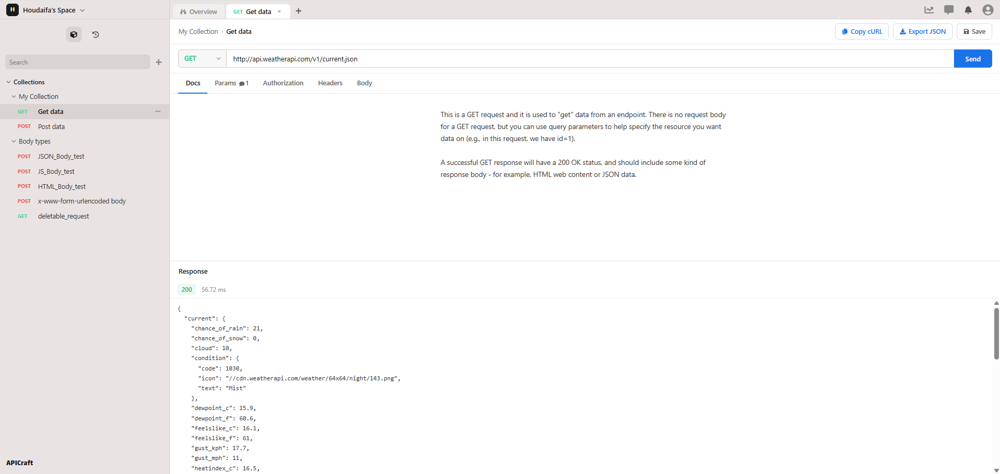

# APICraft

APICraft is a web application for building, organising and running API requests, similar in purpose to tools like Postman. It was developed as the practical part of my bachelor's thesis at FH Aachen, which compares two ways of developing software together with AI coding agents.

## About the thesis project

The same application was developed in two phases, each with a different human-agent collaboration structure:

| Phase | Approach | Branch |
| --- | --- | --- |
| Part 1 | Single-agent development: one AI coding agent, guided by me | [`part1-single-agent-dev`](../../tree/part1-single-agent-dev) |
| Part 2 | Multi-agent development: several specialised agents working together, coordinated by me | [`part2-multi-agent-dev`](../../tree/part2-multi-agent-dev) (this branch) |

Part 2 continues from the code produced in Part 1, so this branch contains the most complete version of the software. The two branches are kept separate on purpose, because the difference between them is what the thesis evaluates.

## Author

Houdaifa Fakih Lanjri
Bachelor's thesis, FH Aachen, 2026
